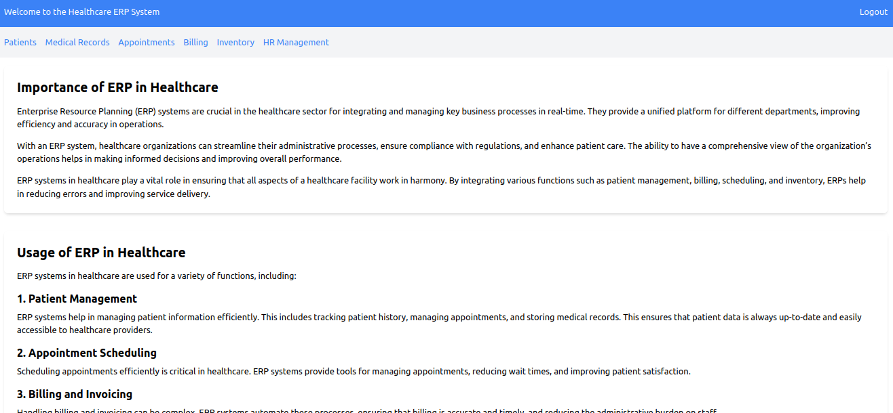

# Healthcare ERP

Healthcare ERP is a web-based application built using Django framework for managing healthcare-related activities such as patient management, medical records, appointments, billing, inventory, and HR management.

## Features

- **User Management**: Differentiates between doctors, patients, and administrative staff.
- **Patient Management**: CRUD operations for patient information.
- **Medical Records**: Maintain patient medical history securely.
- **Appointments**: Schedule and manage appointments between doctors and patients.
- **Billing**: Generate and manage invoices and payments.
- **Inventory**: Track medical supplies and equipment.
- **HR Management**: Manage employee information and roles.

## Installation

Follow these steps to set up the project locally:

1. **Clone the repository**:

   ```bash
   git clone https://github.com/yourusername/healthcare_erp.git
   cd healthcare_erp

    Create and activate a virtual environment (optional but recommended):

    bash
   ```

virtualenv venv
source venv/bin/activate # On Windows use `venv\Scripts\activate`

Install dependencies:

bash

pip install -r requirements.txt

Apply migrations:

bash

python manage.py migrate

Create a superuser (for accessing admin interface):

bash

python manage.py createsuperuser

Run the development server:

bash

    python manage.py runserver

    The project will be accessible at http://127.0.0.1:8000/.

Usage

    Access the admin interface at http://127.0.0.1:8000/admin/ to manage users, patients, appointments, etc.
    Navigate through the different sections using the navigation links provided in the application.
    Customize and extend functionalities as per your requirements.

Contributing

Contributions are welcome! Please follow these steps to contribute:

    Fork the repository.
    Create a new branch (git checkout -b feature/your-feature).
    Make your changes.
    Commit your changes (git commit -am 'Add new feature').
    Push to the branch (git push origin feature/your-feature).
    Create a new Pull Request.

License

This project is licensed under the MIT License - see the LICENSE file for details.

Demo:

<ul>
  <li>Project Screenshot 1
    <br><br>
  </li>
  
</ul>
